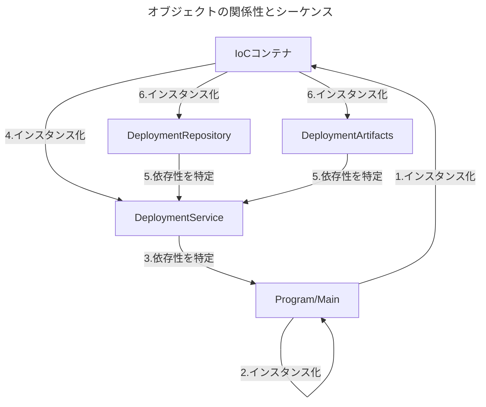
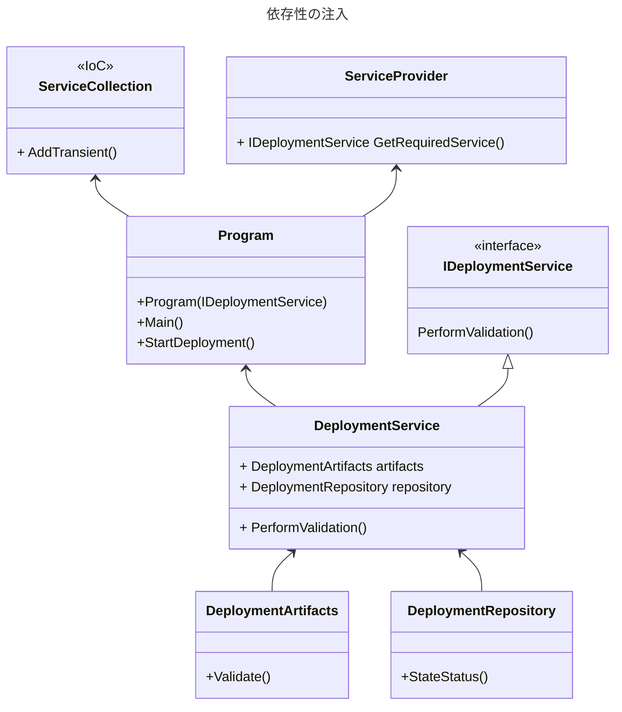

# 型とアプリケーションの構築
## アーキテクチャの構築
- プロジェクトを初めてセットアップする際は、関心の分離（SoC:Separation of Concerns）の概念を用いる
- 各レイヤーはそれぞれの役割を達成する実装となる
- 関心の分離を行うと、コード結合を弱め、特定の処理の検索性を高められる
- 製品の品質向上のため、制御の反転（IoC:Inversion of Control）という概念もある

### パターンの適用
- トランザクションスクリプトを多数作成する場合、いくつかの問題が生じる
  - 相互に影響しあう
  - 1つにまとめづらい複数のオブジェクトを管理が必要
- 例のレシピを使用する際は、他のどのようなケースでコードを単純化できるかを検討してほしい

### オブジェクトの生存期間の管理
- 開発者としての作業には以下がある
  - オブジェクトの生成と使用後の解放
  - オブジェクトのインスタンスの生成
  - 処理実施のためにオブジェクトをメモリ上に維持すること
  - オブジェクトが不要になったタイミングでメモリを解放
- オブジェクト生成の管理には、インターフェースを用いてオブジェクト構築前に機能を定義する手法がある
- オブジェクトのメモリ解放の漏れによって、以下のリスクが存在する
  - メモリ容量
  - ファイルのロック
  - OSリソースを保持しつづける
- リスクによって、異常終了や不具合特定が困難になりえる

#### レシピ1.1 オブジェクト終了期間の管理
■ 課題
大量のリソースを使用することによってアプリケーションが異常終了してしまう
Source: VieModel/Recipe1/BadDeploymentProcess

- SrreamWriter reportが問題
- ファイルを参照し続けるため、常にリソースを解放する必要がある
- 使用後にリソースを解放しなかった場合、全てのアプリケーションがファイルにアクセスできなくなる
- あらゆる操作がエラーとなり、その原因も特定しづらい

■ 解決策
Source: ViewModel/Recipe1/GoodDeploymentProcess

- 破棄パターンを実装してリソースを解放する
  - インターフェースIDisposableを継承し、リソース解放メソッドやファイナライザを実装する
  - disposedフィールドは現在のオブジェクトが1度しか破棄されないようにするために定義
- IDesposableの継承がなくてもオブジェクト廃棄時にファイナライザが呼び出される
  - インスタンス化されたマネージドオブジェクトは、解放されるタイミングを開発者が管理できない
  - 破棄中のオブジェクトがGCで破棄済みとなるリスクがある（ObjectDisposedException）
- ファイナライザを実装していれば、ハンドルなどにより解放できなかったリソースの解放漏れが防げる
- mainメソッドでusingを用いることによって、処理が終了するまでメモリを確保する
  - ブロックの処理が終了すると、オブジェクトのDispose()が呼び出される

■ 注意点
- マネージドリソースでは、ファイナライザを実装してはいけない
  - GCがファイナライザを認識し、破棄処理中にファイナライザを呼び出してしまう（オーバヘッドのリスク）
- 基本的なアプリケーションではアンマネージドリソースのオブジェクトは保持しないので、実装ケースの注意が必要
  - マネージドリソース：C#や.NET Frameworkのオブジェクト
  - アンマネージリソース：ファイルハンドル、APIからのメモリ確保、データベース接続など
- Dispose()メソッド内では、GC.SuppressFinalizeが必要
  - このメソッドによって、GCに全てのリソースの解放を通知できる
  - GCも対象のオブジェクトに対してファイナライザを呼び出すことがなくなる

■ 考えられる他のケース
- アンマネージドリソースで、操作が必要なケース
  - エクセルなどでハンドルを独占するアプリケーション
- 任意のタイミングでリソースを解放したいケース
  - GCによる解放の前で使用する

#### レシピ1.2 明示的な依存の削除
■ 課題
アプリケーションが密結合で、メンテナンスがしづらい
- 密結合とは、あるコードの型が過剰に責任を負っている状態のこと
- 型の変更が責任範囲すべてに影響があり、様々な問題のリスクを孕んでいる
  - 異なるクラスそれぞれで対象の型のインスタンスを重複して実施する
  - 変更するたびに影響範囲が広く、脆弱性の高いコードになる
  - 影響範囲が広いため、テストがしづらい

■ 解決策
依存性を注入する（dependency injection）
Source: ViewModel/Recipe1/DeploymentAtifacts

- 依存性の注入とは、依存関係にある型を1カ所でインスタンス化し、「依存関係にある型を他の方が取り出す」サービスを公開するテクニックのこと
  - 依存性の注入にはサービスロケータや制御の反転（IoC）など、複数の方法がある
  - ケースに応じた方法を採用する必要がある
  - 今回の解決策はIoCを採用している
- 相互に依存した状態を解消する
  - DeploymentServiceクラスに相互に依存しているクラスに依存性を注入して管理する
  - 依存性の注入によってオブジェクトの生成、破棄をコントロールできる
  - 各クラスで別のクラスをインスタンス化している処理を削除して、一元管理するイメージ

■シーケンス

■ 注意点
- 依存クラスの整理が必要
  - クラス設計が明確化されていないと着手できなさそう
- IoCコンテナの実装内容整理
  - 依存性を管理するインターフェイスを実装する（IoCコンテナで関連付けるため）
  - 依存性を管理するクラスを実装する（今回の例ではDeploymentService）
  - 管理クラスで依存する型をインスタンス化する（今回の例では引数で設定）
  - IoCコンテナをインスタンス化して依存性を注入する

<!-- #### レシピ1.x
■ 課題
Source: 

- hoge

■ 解決策
Source: 

- hoge

■ 注意点
- hoge

■ 考えられる他のケース -->
