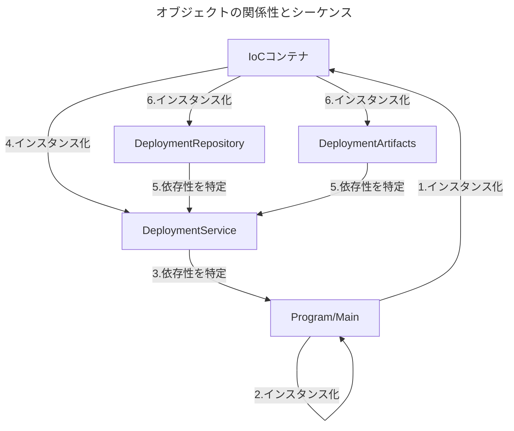
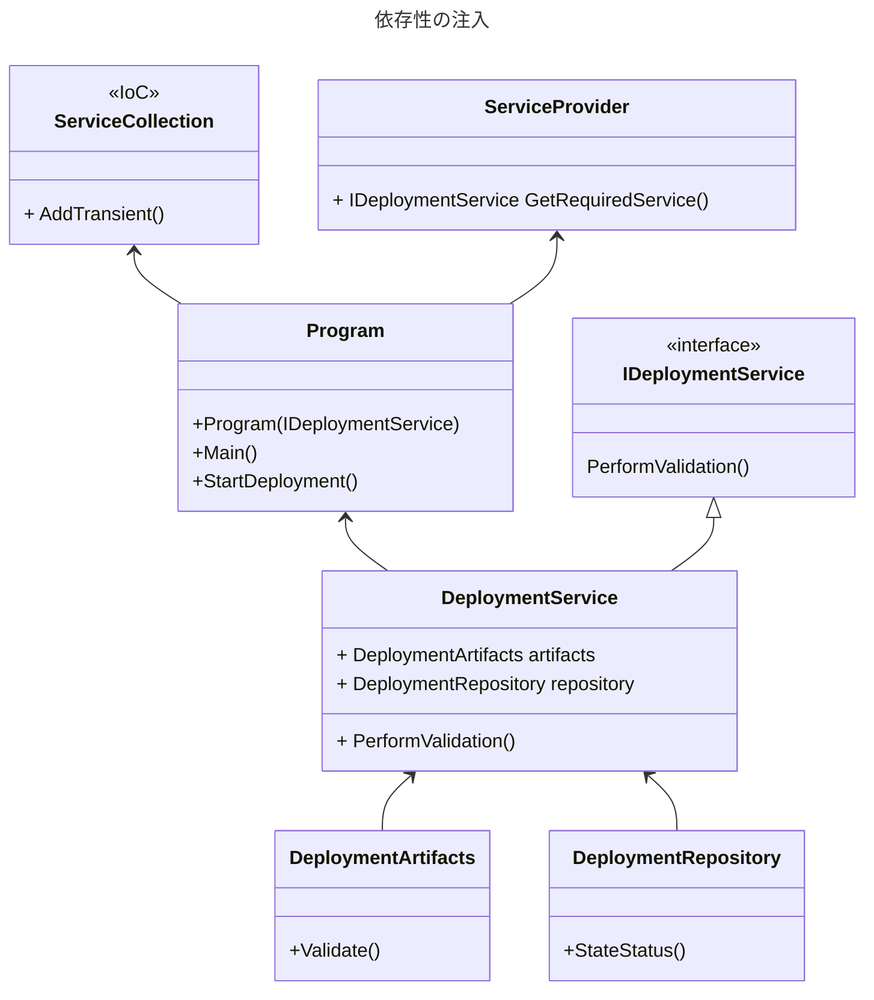

# Recipe1-2
## 明示的な依存の削除
### 課題
アプリケーションが密結合で、メンテナンスがしづらい
- 密結合とは、あるコードの型が過剰に責任を負っている状態のこと
- 型の変更が責任範囲すべてに影響があり、様々な問題のリスクを孕んでいる
  - 異なるクラスそれぞれで対象の型のインスタンスを重複して実施する
  - 変更するたびに影響範囲が広く、脆弱性の高いコードになる
  - 影響範囲が広いため、テストがしづらい

###  解決策
依存性を注入する（dependency injection）
Source: ViewModel/Recipe1/DeploymentAtifacts

- 依存性の注入とは、依存関係にある型を1カ所でインスタンス化し、「依存関係にある型を他の方が取り出す」サービスを公開するテクニックのこと
  - 依存性の注入にはサービスロケータや制御の反転（IoC）など、複数の方法がある
  - ケースに応じた方法を採用する必要がある
  - 今回の解決策はIoCを採用している
- 相互に依存した状態を解消する
  - DeploymentServiceクラスに相互に依存しているクラスに依存性を注入して管理する
  - 依存性の注入によってオブジェクトの生成、破棄をコントロールできる
  - 各クラスで別のクラスをインスタンス化している処理を削除して、一元管理するイメージ

### シーケンス

###  注意点
- 依存クラスの整理が必要
  - クラス設計が明確化されていないと着手できなさそう
- IoCコンテナの実装内容整理
  - 依存性を管理するインターフェイスを実装する（IoCコンテナで関連付けるため）
  - 依存性を管理するクラスを実装する（今回の例ではDeploymentService）
  - 管理クラスで依存する型をインスタンス化する（今回の例では引数で設定）
  - IoCコンテナをインスタンス化して依存性を注入する

